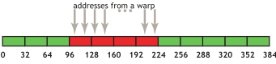

**Disclaimer**: The concepts and project discussed in this article are a part of the course
offering of [ECE 408 / CS 483](https://ece.illinois.edu/academics/courses/ece408) at the
University of Illinois Urbana-Champaign. To maintain academic integrity, the code snippets
below come from external sources (which are cited) and are not my own personal work for
the course nor the project.

## Why GPUs?

Many applications of parallel computing, such as scientific computing, machine learning,
and deep learning require a large amount of numeric computation. GPUs are particularly
well-suited for these applications due to their ability to do high-throughput work, when
compared to CPUs.

[Modern GPU architectures](https://docs.nvidia.com/cuda/cuda-c-programming-guide/index.html#compute-capabilities)
support computation over thousands of threads, which are organized into blocks.
Blocks are organized into grids. Within each block, threads execute instructions
in groups called warps.

Fortunately, many popular computational patterns, such as
[vector mathematics](https://en.wikipedia.org/wiki/Vector_(mathematics_and_physics)),
[matrix multiplication](https://en.wikipedia.org/wiki/Matrix_multiplication),
[discrete convolution](https://en.wikipedia.org/wiki/Convolution#Discrete_convolution),
[scanning](https://en.wikipedia.org/wiki/Prefix_sum),
and [reduction](https://en.wikipedia.org/wiki/Fold_(higher-order_function))
map nicely into this three-dimensional grid-like pattern.

### A Simple Example: Vector Addition

A very simple example of parallelizing computation is vector addition.
Let's say we have two vectors: $a, b \in \mathbb{R}^n$. We want to compute
$c_i = a_i + b_i$. The sequential CPU code in C++ may look something
like this:

```cpp
// Source: https://www.olcf.ornl.gov/tutorials/cpu-vector-addition/
// Sum component wise and save result into vector c

for (int i = 0; i < n; i++) {
    c[i] = a[i] + b[i];
}
```

We recognize that every output element of $c$ can be calculated independent of
every other output element. We can assign one output element of $c$ to one GPU
thread. Each thread determines which element of $c$ it computes based on its
block and thread index (which block it is a part of and its position in that
block).  We must also be careful to avoid reading and writing out of the bounds
of the input and output arrays.

```cpp
// Source: https://www.olcf.ornl.gov/tutorials/cuda-vector-addition/
// CUDA kernel. Each thread takes care of one element of c

__global__ void vecAdd(double *a, double *b, double *c, int n) {
    // Get our global thread ID
    int id = blockIdx.x * blockDim.x + threadIdx.x;

    // Make sure we do not go out of bounds
    if (id < n)
        c[id] = a[id] + b[id];
}
```

## Memory Hierarchy and Optimizations


Source: [Efficient Parallel Implementations of LWE-Based Post-Quantum Cryptosystems on Graphics Processing Units](https://www.researchgate.net/publication/346228460_Efficient_Parallel_Implementations_of_LWE-Based_Post-Quantum_Cryptosystems_on_Graphics_Processing_Units) by SangWoo An and Seog Chung Seo is licensed under [CC BY 4.0](https://creativecommons.org/licenses/by/4.0/)

The memory hierarchy of NVIDIA GPUs presents opportunities to optimize
the efficiency of memory accesses in CUDA kernels.

### Global memory

Global memory is the primary memory space of the GPU. Calls to CUDA API
functions like `cudaMalloc`, `cudaMemset`, and `cudaMemcpy` can be used
to interact with global memory to allocate, initialize, and transfer data
between the device (GPU) and host (CPU).

### Shared memory

Shared memory is allocated per-block and shared among threads of the block.
A potential optimization using shared memory is to load tiles of frequently
reused data into shared memory. This may require barrier synchronization
using `__syncthreads()` which reduces parallelism but is needed to satisfy
dependencies. Rather than fetching data from global memory, which is a slow
process taking many cycles, threads can quickly read data loaded into the
shared memory tile. An example usage of this optimization is tiled, shared
memory matrix multiplication.

### Constant memory

Constant memory is an area of memory which serves essentially as a read-only
cache. Data can be copied to the device's constant memory and similar to
shared memory, accesses to constant memory run much faster than accesses to
global memory. An example usage of this optimization is loading a convolution
mask into constant memory.

### Memory coalescing

Memory coalescing refers to an access pattern in which several threads of a
warp access adjacent memory locations.



Source: [NVIDIA CUDA C++ Best Practices](https://docs.nvidia.com/cuda/cuda-c-best-practices-guide/index.html#coalesced-access-to-global-memory)

With coalesced accesses, we move closer to maximizing global memory bandwidth,
as we make maximal use of data returned in DRAM bursts.

## Convolution

A convolution layer of a convoluational neural network performs an element-wise
dot product between the input and mask, which "slides" across the input, to
produce the output. It can be used in applications such as image processing to
perform blurring, sharpening, or edge detection.


Source: [2D Convolution Animation](https://en.wikipedia.org/wiki/File:2D_Convolution_Animation.gif) by Michael Plotke is licensed under [CC BY-SA 3.0](CC BY-SA 3.0)

## Parallelized LeNet Convolution Layer

The parallelized convolution layer runs in a
[LeNet](https://en.wikipedia.org/wiki/LeNet)-like neural network architecture.
To perform inference with a convolutional layer, we perform a parallel
convolution to compute every output element for each image per batch,
for all output feature maps. Images may also have several channels, for
example RGB values, over which the convolution is computed.

### Performance

The baseline sequential CPU code runs inference of a batch of 10,000 images in
roughly 95s. The baseline parallelized GPU code runs the same batch in roughly
90ms for a 99.9% speed improvement. Further specialized optimizations reduce
the runtime to roughly 69ms from the baseline parallel implementation.
